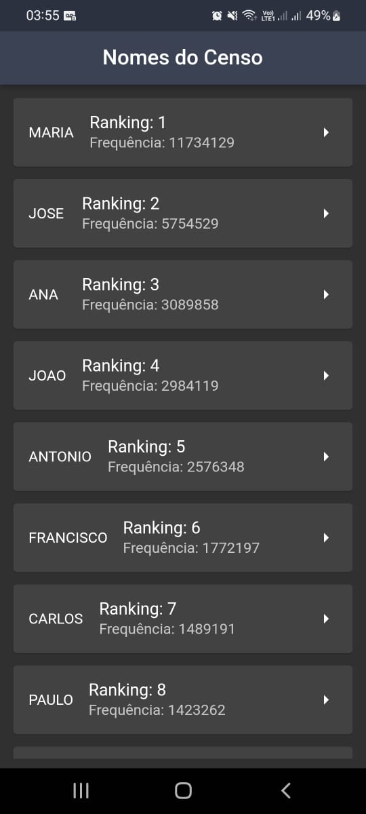
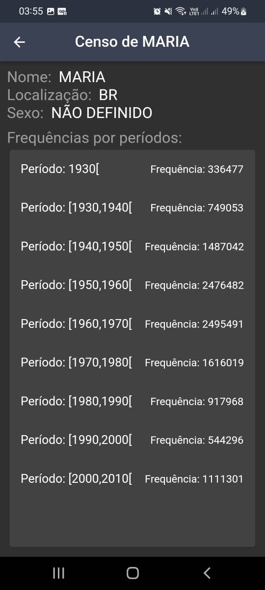

<h2 align="center">
  MobX e MVVM
</h2>

 

<h3 align="center">
  
  
</h3>

---

## 📃 Sobre

Este projeto foi desenvolvido para um teste, em que era preciso montar uma listagem de elementos consumindo o seguinte endpoint: `https://servicodados.ibge.gov.br/api/v2/censos/nomes/`, além de ser necessário montar uma tela de detalhes do elemento ao clicar no mesmo (na listagem). Neste projeto foram adicionados também testes unitários e testes de Widgets.
 
O projeto foi feito com MobX (usando codegen), sendo um MVVM com repository.

---

## Plano de desenvolvimento da aplicação

Com relação à construção do projeto, o mesmo foi feito utilizando o “VSCode”,
que é um editor de código-fonte muito utilizado no mercado de trabalho e que dá
suporte para várias linguagens e ou frameworks, tal como no caso do “Flutter” e do
“Dart”. Com relação a este projeto em específico, o mesmo foi subido para o “Github” (uma plataforma na nuvem que serve para hospedagem de códigos fonte, além de fornecer várias funcionalidades).  
A linguagem escrita utilizada no projeto foi o inglês, ou seja, cada arquivo dentro
do projeto está escrito em inglês na linguagem de programação “Dart”, assim como o nome das pastas também está em inglês.
 

--- 

## ⭐ Imagens da aplicação
 

  ")

---

## 🚀 Tecnologias e recursos utilizados

Este projeto foi desenvolvido com as seguintes tecnologias:
- [**Visual Studio Code**](https://code.visualstudio.com/): um editor de código-fonte desenvolvido pela Microsoft, que é multiplataforma e muito utilizado;
- [**Dart**](https://dart.dev/): Linguagem de programação;
- [**Flutter**](https://flutter.dev/): Uma UI Toolkit que traz várias facilidades para desenvolvimento Cross-Platform;

---

## 🔧 Instalação e execução

Um dos requisitos para a construção deste projeto era ter instalado na máquina
de trabalho o “SDK” do Flutter para ser possível a compreensão de seu código, e
como facilitador tem-se a adição de um “CLI” próprio para facilitar o uso de comandos
de acesso ao “Flutter” via terminal (ou seja, foi-se adicionado na variável “PATH” do
computador o caminho onde o binário do Flutter estava para que dessa forma, via
linha de comando, fosse possível a execução de comandos “Flutter”). A versão do Flutter utilizado no projeto foi a "2.10.5". Tendo estes requisitos, basta clonar o repositório, rodar o comando `flutter clean` para limpar os dados de cache das dependências, e, depois, rodar o comando `flutter pub get` para baixar as dependências deste projeto, e pronto, já será possível rodar o mesmo.

<h5 align="center">
  &copy;2022 - <a href="https://github.com/matheusEduardoTavares">Matheus Eduardo Tavares</a>
</h5>